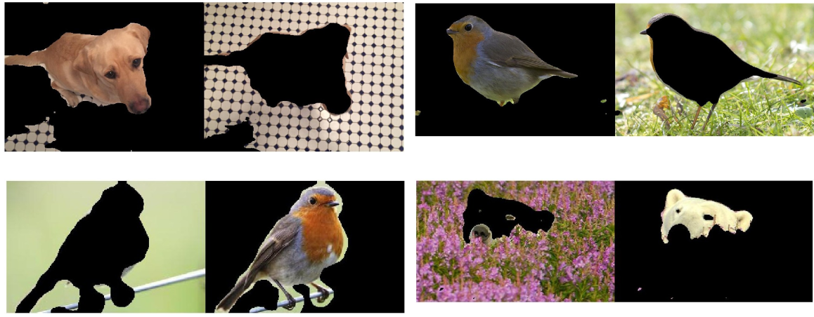

# Computer-Vision-1

This repository contains code for the labs of the Computer Vision 1 course at the University of Amsterdam.

### Lab 1 - Photometric Stereo, Color Spaces, Intrinsic Image Decomposition and Color Constancy

[Problem](lab1/Lab01_Instruction.pdf), [Report](lab1/photometric-stereo-color.pdf), [Code](lab1/)

   
  <i>Original image (a) and corrected image (b) using Grey-World algorithm.</i>
   
 

 
 ### Lab 2 - Neighborhood Processing & Filters
 
 [Problem](lab2/Lab02_Instruction.pdf), [Report](lab2/11593040_11576200.pdf), [Code](lab2/)
 
 

   
  <i>Gabor Segmentation of different images, Kobi, Robin-1, Robin-2, Polar (reading row-wise). </i>
   
 

 
 ### Lab 3 - Harris Corner Detector & Optical Flow 
 [Problem](lab3/Lab03_Instruction.pdf), [Report](lab3/harris-corner-detector.pdf), [Code](lab3/)
 
 

   
  <i>Tracking via optical flow </i>

